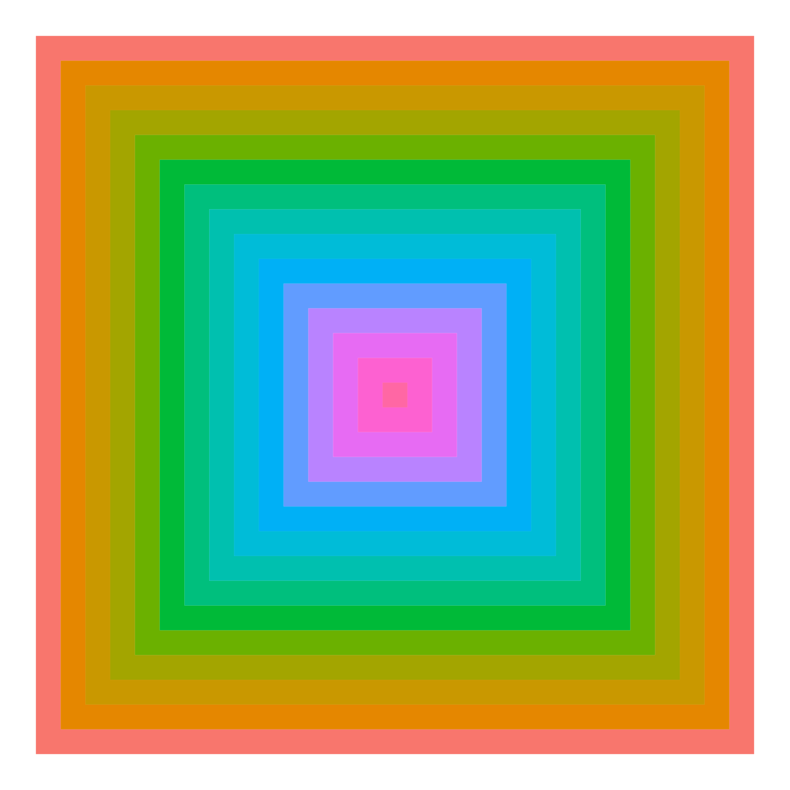
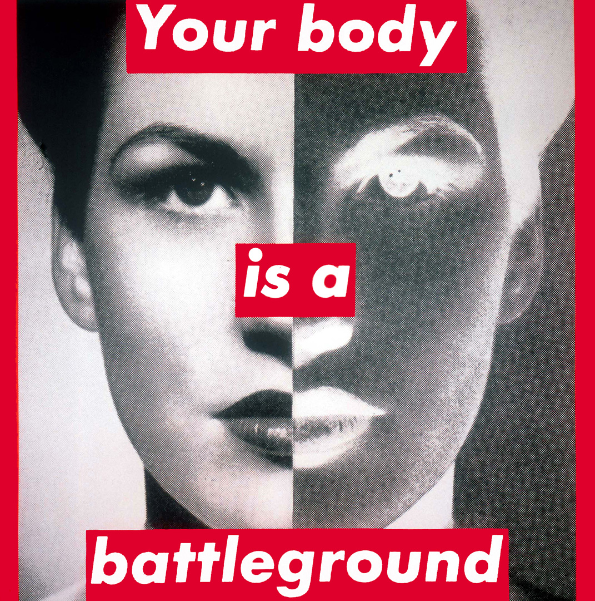
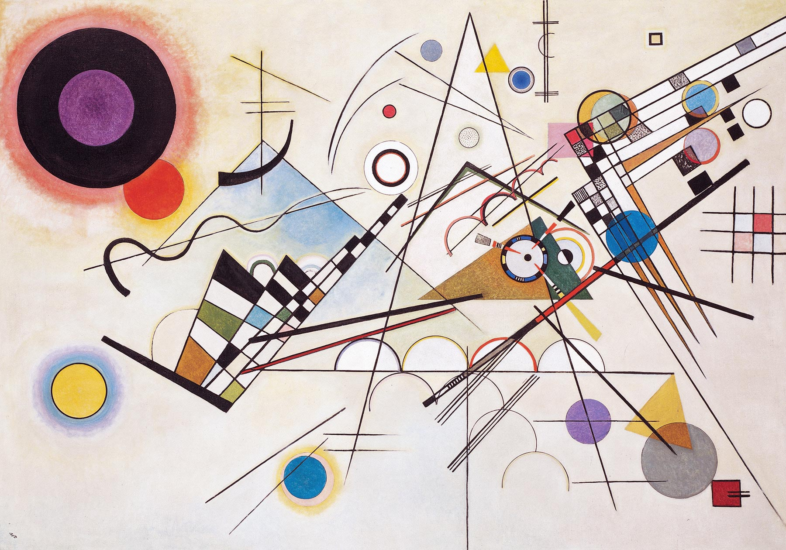
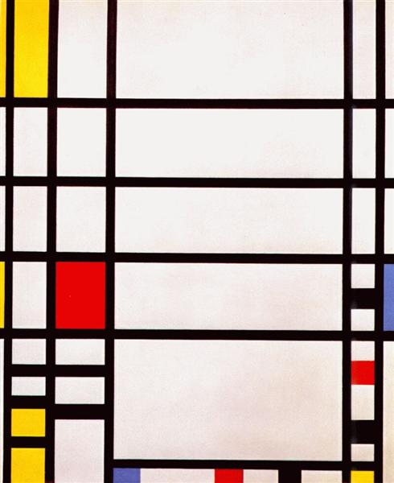

# Project 2 (Viz Biz)

*Author: Eli Feder, Lillian Clark, Phillip Harmadi, Sana Pashankar*

**TABLE OF CONTENTS:**
1. Proposal
2. Eli's Artwork Shiny: *Untitled - Barbara Kruger* (**150-250 words summary and methodology** of the artwork will be on this folder's README.md)
4. Lilly's Artwork Shiny: *Composition 8 - Wassily Kandinsky* (**150-250 words summary and methodology** of the artwork will be on this folder's README.md)
5. Phillip's Artwork Shiny: *Experiment and Change - Frank Stella* (**150-250 words summary and methodology** of the artwork will be on this folder's README.md)
6. Sana's Artwork Shiny: *Trafalgar Square - Piet Mondrian* (**150-250 words summary and methodology** of the artwork will be on this folder's README.md)
7. Final Shiny App (The **1000-2000 words final writeup** will be on this folder's README.md)
8. Presentation

*Note: Each of the individual artwork's 150-250 words summary will later be combined into the 1000-2000 words final writeup.*

**WRITEUP**

## Introduction

For this project, we created a convenient website where non-R users and the general public can navigate to and customize several famous modern art pieces recreated in ggplot, modifying some of the artwork aesthetics to make the masterworks their own. Our goal specifically was to promote digital extensions of modern, abstract paintings and to allow users to make art personalized to their taste, which they can download for their own use. Furthermore, in this project, we strived to increase public appreciation and awareness of using digital techniques, such as ggplot, to recreate art or make original digital art. 

We plan to recreate and make customizable the following four images:

#### Frank Stella, *Lettre sur les sourds et muets II* (1974) [1]

#### Barbara Kruger, *Untitled (Your body is a battleground)* (1989) [2]

#### Wassily Kandinsky, *Composition 8* (1923) [3]

#### Piet Mondrian, *Trafalgar Square* (1939-1943) [4]

To recreate these modern art pieces, we will be creating our own dataframes, which will incorporate user input to customize certain artistic aspects of each piece. We will also utilize mathematical functions and specific packages such as `library(colourpicker)` and `library(generativeart)` to facilitate the digitization of these art pieces. 

## Approaches 

### Frank Stella, *Lettre sur les sourds et muets II* (1974)

The painting’s symmetrical and easily identifiable features are what
attracts us to recreate a visualization of this masterpiece. 4 distinct
features spark our interest. We also believe that these features should
be made *adjustable/modifiable* to the preference of each audience:

**Number of layers**

In the original painting, there are 12 layers
of colored-gradient rectangles and 11 layers of
black-and-white-gradient rectangles (23 layers in total),
alternating against one another. We would like the audience to be
able to determine how many layers do they want to have in total in
their final piece of art, depending on the purpose of usage 
(small/nightstand or big/wall decorations).

To alter the number of alyers, we will use the ‘slider input’ Shiny widget in the
UI interface.`sliderInput(inputId = "size", label = "Size:", min = 10, max = 50, value = 20)`
In the server, the input ‘size’ will and integral component to
create the dataframe that will be used in the plotting process.
`n <- reactive({input$size * 2})`

**Primary color sequence**

The original painting uses a rainbow-gradient color sequence as part of its 
12 layers of colored-gradient rectangles. For the recreated visualization, the
audience will be able to change this through adjusting the color
palette and decide whether or not to reverse the direction of the color sequence.

**Secondary color sequence**

The original painting uses a black-and-white-gradient color sequence as part 
of its 11 layers of non-colored-gradient rectangles. For the recreated visualization,
the audience will be able to change this through adjusting the color palette and
decide whether or not to reverse the direction of the color sequence.

**Borderline**

We’ve noticed that the original artwork contains a thin white borderlines 
between each of the rectangle layers. We believe that some of our audience 
like this feature but not all, hence, we make it an option for the audience to 
preserve or remove the borderlines in their final plot.

To do this, we will use the ‘switch input’ Shiny widget in the UI interface to 
turn on/off the borderline.`switchInput(inputId = "borderline", label = "Borderlines", value = FALSE)`
In the server, the reactive input ‘borderline’ will be part of the aesthetic 
in the ggplot. `geom_polygon(..., size = borderline())`

### Barbara Kruger, *Untitled (Your body is a battleground)* (1989)

### Wassily Kandinsky, *Composition 8* (1923)

### Piet Mondrian, *Trafalgar Square* (1939-1943) 

This painting’s geometric shapes and lines are what allowed us to recreate this 
visualization in ggplot2. 2 distinct
features sparked our interest to make *adjustable/modifiable* to the preference 
of each audience:

**Horizontal Lines**

In the original painting, there are 4 horizontal lines
that seem to be evenly distributed within the middle of the painting. We would like the 
audience to be able to create more horizontal lines between the upper and lower bounds 
of the original horizontal lines to adjust the abstract feel of the art and 
to make it more to their liking. 

Specifically to adjust these lines, we will use the ‘slider input’ Shiny widget in the UI interface
`sliderInput(inputId = "lines", label = "Number of lines:", min = 2, max = 10, value = 4)`
Because the original four horizontal lines are defined by one specific function (geom_hline()), 
we were able to pass the input from the UI sliderinput to a parameter in the geom_hline()
to change the number of horizontal lines between the defined upper and lower bounds. 
    

**Colors**

The original painting uses four distinct colors: blue, black 
red and yellow in different colored boxes. We wanted to give users the ability to change 
these colors based on their likings and to understand how a new color scheme 
changes the vision of the art. 

To do this, we will use the `checkboxGroupInput` in the UI interface
to allow users to select four colors out of list of multiple color options. If the user picks 
more than four colors, only the first four colors will show up. If the user uses less than 
four colors, the boxes corresponding to the missing color will show up blank (i.e. white). 

## Discussion