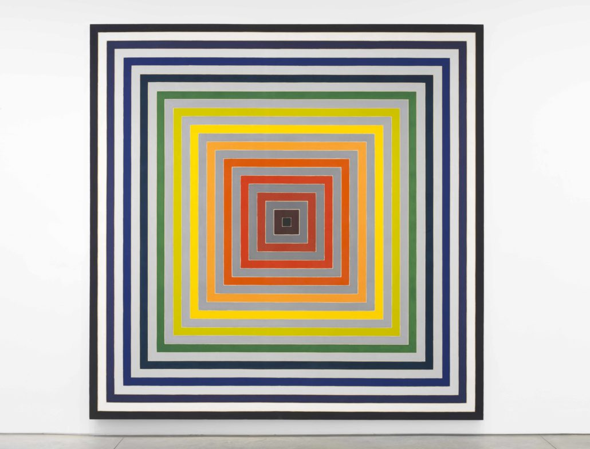
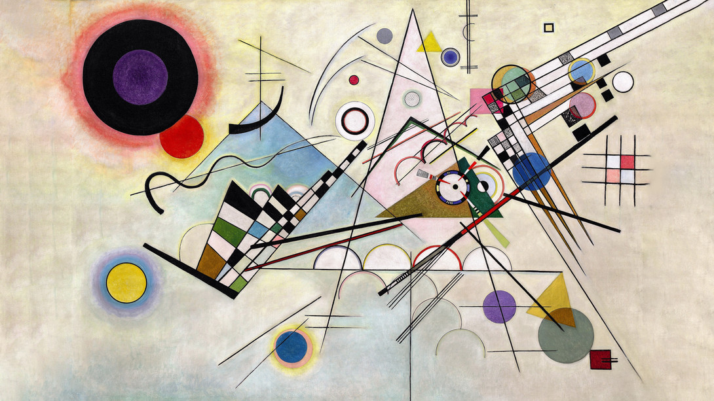

```{r setup, include=FALSE}
knitr::opts_chunk$set(echo = TRUE)
```

## Goals

We strive to create a convenient website where non-R users and the general public can navigate to and customize several famous art pieces recreated in ggplot, modifying some of the artwork aesthetics to make the masterworks their own. 

Our goal is to promote digital extensions of modern, abstract paintings and encourage users to  play with and modify pieces with significance and status in the art world. Wealthy collectors, curators, and gallery owners have historically had a massive amount of power in determining what is considered “good art” and what sells. We see our project as part of the move to question empty status designations and push back against institutional art gatekeeping. We will do this by creating a convenient website where users can access several examples of recreated art pieces and adjust their aesthetics based on one’s personal preference and download them for their personal use. 

In addition, our motivation is also to increase public appreciation and awareness on the advent of using digital techniques to recreate modern or postmodern artworks and help spark the tech community's interest in contributing to R by developing and creating more R packages (especially in generative art and ggplot). We hope that our work will contribute positively to popularize the usage of R not only among statisticians and data scientists, but also among digital designers and professionals that don't tend to work with data.

We are going to use our own created dataframes (based on user inputs), mathematical functions, and  packages such as `library(colourpicker)` to recreate art pieces in ggplot. For instance, when recreating Frank Stella's artwork, users will be able to determine how many layers of rectangles do they want to have in the final plot, and we will create the dataframe manually according to that selected input.

We plan to recreate and make customizable the following four images:

#### Frank Stella, *Lettre sur les sourds et muets II* (1974) ^[NSU Art Museum, https://nsuartmuseum.org/exhibition/frank-stella-experiment-and-change/]

{width=40%}

#### Barbara Kruger, *Untitled (Your body is a battleground)* (1989) ^[The Broad, https://www.thebroad.org/art/barbara-kruger/untitled-your-body-battleground]

{width=30%}

#### Wassily Kandinsky, *Composition 8* (1923) ^[Guggenheim, https://www.guggenheim.org/artwork/1924]

{width=40%}

#### Piet Mondrian, *Trafalgar Square* (1939-1943) ^[Wikiart, https://www.wikiart.org/en/piet-mondrian/trafalgar-square-1943]

{width=25%}


## Plan of Attack

**Week of Mon, Nov 1:** 

Each member will select one generative art piece that they would like to make (total = 4).

As a team, we will draft and finalize the initial project proposal.

**Week of Mon, Nov 8:** 
 
Each member will make an individual prototype ggplot object and ShinyR website to ensure that users can modify aesthetics (such as shapes, sizes, colors, and positions of objects as well as any text content) in their digital art.
 
**Week of Mon, Nov 15:**
 
Gather feedback from teammates to improve each individual work. Every team member should draft a 150-250 (total = 600-1000) word summary of their artwork methodology for the write-up. Put the summary on each one designated folder’s README.md.
 
Once done, each member can proceed as soon as possible to their task in the Week of Mon, Nov 22 (since it will be Thanksgiving week).
 
**Week of Mon, Nov 22:**
 
Sana + Eli: Start drafting on the writeup (introduction, conclusion) and combine 4 mini-summaries from each of the artwork from the previous week). This final write up will be on the README.md of the final combined Shiny App folder.
 
Lillian + Phillip:  Combine everyone’s individual Shiny app into a single comprehensive Shiny app. Try to code an app that is simple, aesthetic, and can be easily navigated by users.
 
**Week of Mon, Nov 29:**
 
Finalizing writeup and creating the slides and preparing for the presentation on Friday.


## Project Organization

Within our project, we will have seven different folders. The first folder will be the proposal, which will include a README.md that explains the goals and plan of our project. Then, the four of us will each have a folder with our shiny app in it, in which we will work on recreating the chosen art piece. The README.md for each of these folders with have the name of the artwork we are recreating and 150-250 words summary and methodology of how we recreated the artwork. We will have a folder with the final shiny app, in which we will combine all of our individual work. The README.md for this will contain the final 1000-2000 word write-up. Finally, we will have our presentation folder, which will contain our slides and code for our final project presentation. 


