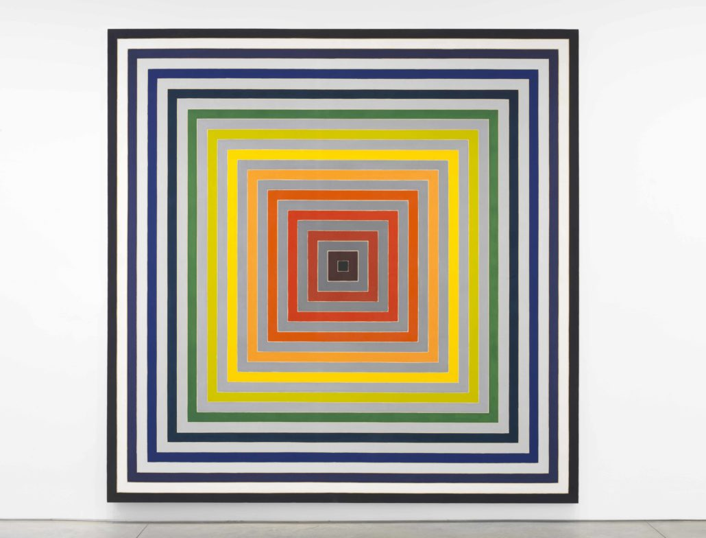
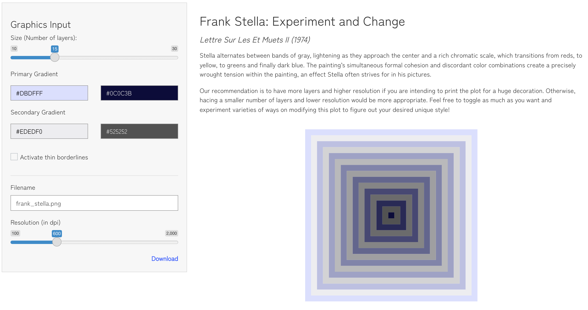
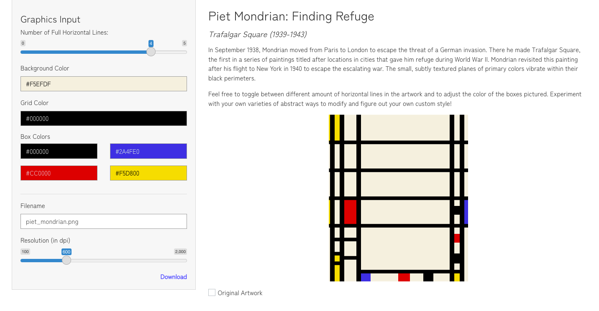
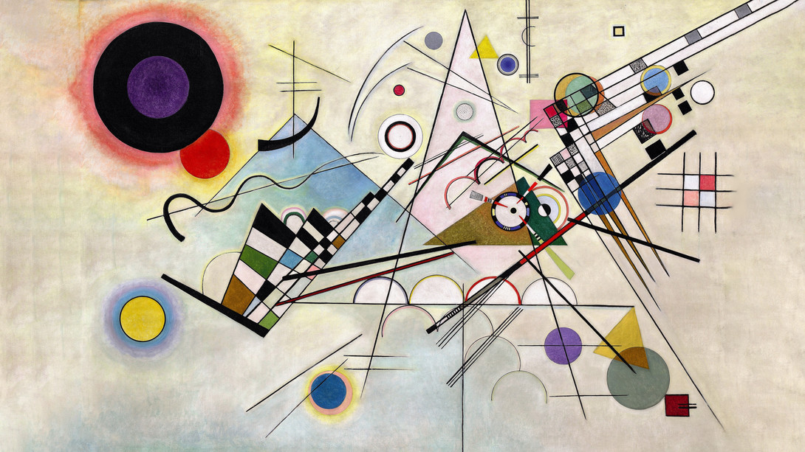
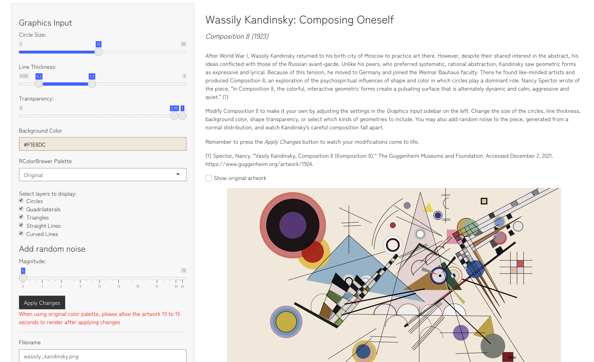
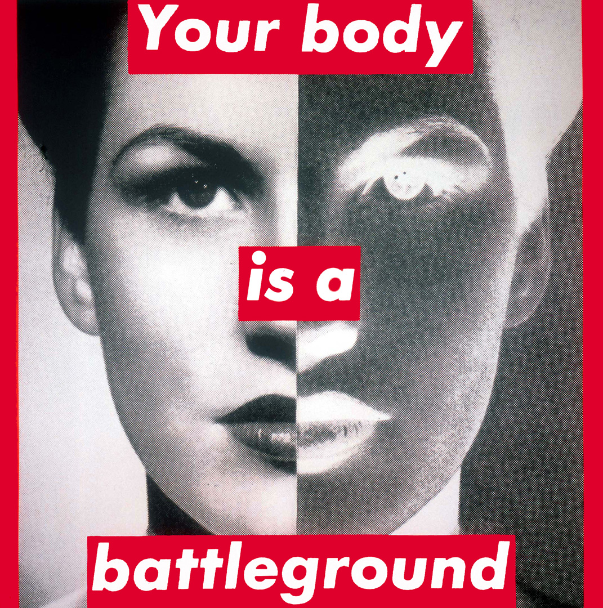
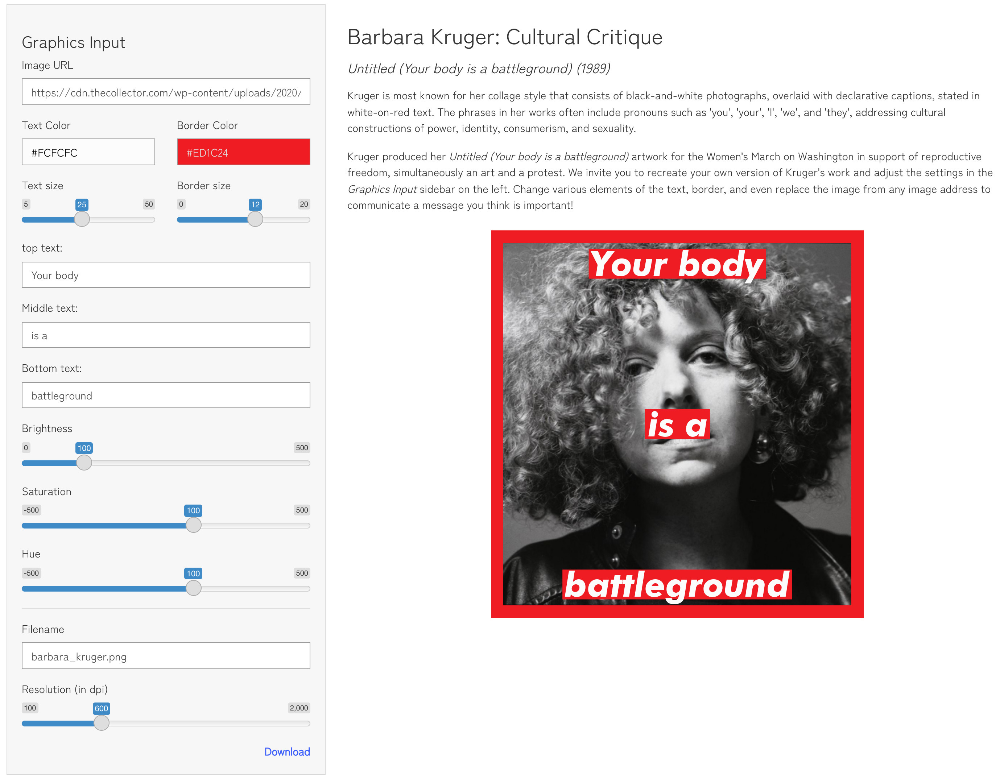

# Project 2 Write-up

*Author: Eli Feder, Lillian Clark, Phillip Harmadi, Sana Pashankar*

**Shiny App**: https://phillip.shinyapps.io/viz_biz/

**Presentation:** https://www.youtube.com/watch?v=XKLo-fSvngk

## Introduction

We created a website where the public can navigate and customize famous art pieces recreated in ggplot, modifying the artwork aesthetics to make the masterworks their own. Our goal is to promote digital extensions of modern, abstract paintings and allow users to download personalized versions. We also strive to increase public awareness of the promise of R packages like ggplot for digital art. 
To recreate our **chosen 4 modern art pieces**, we fabricated dataframes which can incorporate user input to customize ggplot aesthetics. We also utilized mathematical functions and packages like `colourpicker` and `generativeart` to facilitate digitization.

We then these pieces in a Shiny App, where an initial tab provides a brief overview of the site, and the 4 following tabs house each of the pieces. Users
may change features such as colors, number and amount of certain shapes, transparency, and more
throughout. 

## Approaches 

### [1] Frank Stella, *Lettre sur les sourds et muets II* (1974)

The painting’s symmetrical and easily identifiable features are what
attracts us to recreate a visualization of this masterpiece. 4 distinct
features spark our interest. We also believe that these features should
be made *adjustable/modifiable* to the preference of each audience:

**Number of Layers**

In the original painting, there are 12 layers
of colored-gradient rectangles and 11 layers of
black-to-white-gradient rectangles (23 in total),
alternating against one another. We would like the audience to adjust the number of layers they want to have in
their final artwork, depending on the purpose of usage 
(small/nightstand or big/wall decorations).

To alter the number of alyers, we used the ‘slider input’ Shiny widget in the
UI.`sliderInput(inputId = "size", label = "Size:", min = 10, max = 50, value = 20)`
In the server, the input ‘size’ will and integral component to
create the dataframe that will be used in the plotting process.
`n <- reactive({input$size * 2})`

**Primary Gradient**

The original painting uses a rainbow-gradient color sequence as part of its 
12 layers of colored-gradient rectangles. For the recreated visualization, the
audience will be able to change this through adjusting the color
palette and decide whether or not to reverse the direction of the color sequence.
Using Shiny reactive `colourInput(...)` function, every user is able to pick any hex color
he/she wish as the starting and ending color of the gradient.

**Secondary Gradient**

Similar to *primary gradient* above.

**Borderline**

We’ve noticed that the original artwork contains a thin white borderlines 
between each of the rectangle layers. We believe that some of our audience 
like this feature but not all, hence, we make it an option preserve or remove them.

We used the ‘switch input’ Shiny widget in the 
interface to 
turn on/off the borderline.`switchInput(inputId = "borderline", label = "Borderlines", value = FALSE)`. 
In the server, the reactive input ‘borderline’ will be part of the aesthetic 
in the ggplot. `geom_polygon(..., size = borderline())`.

### [2] Piet Mondrian, *Trafalgar Square* (1939-1943) 

This painting’s geometric shapes and lines allow us to recreate this 
visualization in ggplot2. 2 distinct features sparked our interest to make 
*adjustable/modifiable* to the preference of each audience:

**Horizontal Lines**

There are 4 horizontal lines that seem to be evenly 
distributed within the middle of the original painting. We would like the  audience to be 
able to create more/less horizontal lines between the upper and lower bounds of the 
original horizontal lines to adjust the abstract feel of the art and to make it 
more to their liking. 

Specifically to adjust these lines, we will use the `sliderInput(...)` Shiny widget in the UI
`sliderInput(inputId = "lines", label = "Number of lines:", min = 0, max = 5, value = 4)`
Because the original four horizontal lines are defined by one specific function `(geom_hline())`, 
we were able to pass the input from the UI `sliderInput` to a parameter in the `geom_hline()`
to change the number of horizontal lines between the defined upper and lower bounds. 
    
**Colors**

The original painting uses 4 distinct colors in different colored boxes. 
We wanted to give users the ability to change 
these colors and to understand how a new color scheme 
changes the vision of the art. To do this, we will use 4 `colorInput`s in the UI
to allow users to select four color hexes (no restriction of the color being 
same or different with one another).

### [3] Wassily Kandinsky, *Composition 8* (1923)

We chose to recreate *Composition 8* because of Kandinsky's knack to create
drama from simple geometries -- circles, polygons, and straight lines -- which 
are well-suited to `ggplot`. Unlike his Russian contemporaries, Kandinsky saw 
forms and colors as expressive, psychological, and spiritual. We made the 
following aesthetics *adjustable/modifiable* to allow viewers to encode their 
own meaning in the piece.

**Circle Size**

Kandinsky loved circles. Because of these shapes' significance to the artist, a 
`sliderInput()` modifies the radii encoded in the original data which are then
plotted via `geom_circle()` layers.

**Thickness, Transparency and Background**

The user can also modify line thickness and fill transparency. The line option 
has the most impact when the minimum thickness increases -- it gives the piece a
cartoon feel. Like previously, `colourInput()` allows selection of the backdrop. 
All these inputs modify ggplot characteristics, `scale_size_manual()`, 
`scale_alpha_manual()`, and `theme()` respectively, not the data. 

**Palette**

A dropdown menu offers the user all `RColorBrewer` 
palettes to choose from to color the shapes and curved lines. Instead of 
referencing hex codes in the data, `if` statements triggered by user selection 
in custom plotting functions use broad color categories from the data to 
implement these palettes. Palettes other than the original decrease rendering
speed.

**Layers**

Sometimes less is more. To simplify the piece, users can opt to remove any of 
the following elements as a whole: circles, quadrilaterals, triangles, straight 
lines, or curved lines.

**Random Noise**

A popular conception of abstract art is that it is random, thoughtlessly or 
mechanistically constructed and easy to replicate. Users can see for themselves 
whether this is true by adding random draws from a normal distribution (centered 
at 0 and with standard deviation set as "magnitude" with `sliderInput()`) to the
coordinates of each element. Certain coordinates experience the same 
transformation in groups to retain some visual order.

### [4] Barbara Kruger, *Untitled (Your body is a battleground)* (1989)

The piece’s easily simple, yet eye-catching features are what attracted us to 
recreate a it as a visualization. Four distinct features sparked our interest
and were made to be modifiable to the preference of the user so that they could
communicate their own distinct message, just like Barbara Kruger:

**Text** 

In the original piece, there are three rows of text (top, middle, and bottom). 
Our goal with this feature of the piece was to allow the user to change what the 
text displays (the actual words), the size of the text, and the color of the 
text. We used three `textInput()`s to control what was displayed in the three 
rows of text, a `sliderInput()` to control the size of the text, and a 
`colorInput()` to control the color of the text. All three types of inputs were
used to set visual properties in the ggplot visualizationnvia `geom_label`.

**Border/Labels**

For the recreated visualization, we wanted the user to be able to change the 
color and size of the border, and the color of the labels, both elements that 
help to make Kruger's piece stand out. To accomplish this, we used a 
`sliderInput()` to control the size of the border and a `colorInput()` to
control the color of the border and background labels. The input for border 
color and label color was the same so the two parts of the visualization would 
be the same color, as they are in Kruger's original work. Both inputs were used 
to set visual properties in the ggplot visualization via `geom_rect`. The 
reactive image dimension variables (which were created from the reactive link 
variable) were integral components in specifying the location of the border 
around the image, as well as the location of the labels (and text) on the image.

**Background Image/Image Link**

The original piece uses a black-and-white portrait as a backdrop. For the
recreated visualization, our objective was to allow the user to change this 
image by pasting an image address into a text input. The visualization would 
then dynamically change to have the new image be the backdrop, with all elements
being scaled to fit the dimensions of the new image. The user would also be able 
to adjust the brightness, saturation and hue of the image. To go about 
implementing these aspects of the visualization, we used a `textInput()` to 
access the user-inputted link. In the server, the reactive input ‘path’ (the
variable name for the link) was used to create variables for image dimensions
(as mentioned above). Additionally, the link input was read and used to display 
the background image via `draw_image`. Three `sliderInput()`s were utilized to 
control the brightness, saturation and hue. The three inputs were used to set 
visual properties in the ggplot visualization via `image_modulate`.

## Discussion

Within this project, one challenge all of us faced was learning the nuances of Shiny. Before this project, all of us had little to no experience with Shiny App, and the grammar of the platform and creating the app was unfamiliar to us.

We learned a lot about the behavior of Shiny reactive inputs and using
`reactive({...})` whenever we are trying to define a variable that is dependent on reactive
input(s). We tackled how to create a non-static dataset when
recreating Stella's artwork. As a user modifies the number of layers, the
dataset will need to adjust dynamically, hence, our team created a function with the
number of layers (the reactive input) as one of the function's parameters.

Deprecated functionality of the `order` aesthetic in `ggplot()`, an unclear ordering mechanism 
in `geom_circle()` from `ggforce`, and complex interplay between layers in the original artwork
led us to adopt a radically different approach in structuring the manually generated data for 
Kandinsky's piece. We split each dataset of a type of geometry (e.g. circles, semicircles, lines,
triangles, etc.) into layers and stored each layer as a separate dataframe in a list. (The code 
to create the original data is visible in `create-kandinsky-data.Rmd` in the `data` folder within
the final Shiny app.) Because of this, we conducted all data modification and plotting through `for` loops and functions which accessed specified data frames within each list. More clear and consistent methods for control of the order in which points are plotted within a layer would render this workaround less necessary.

Another challenge that we encountered was allowing for a user to input an image URL of their 
choice into the Kruger section of the Shiny app. Not only was the link input reactive, 
but we also encountered an error where the app would crash if an invalid URL was used. To address 
this issue, we kept the original link variable as is if the link was valid and updated it to the original Kruger image URL if not. Hence, there will always be a valid URL being used to read-in the image. We also added an error message if the link turned out to be invalid. 

To conclude, we are satisfied with our final result. With more time, possibilities for improvement
could include allowing users to select more than 2 color checkpoints for the primary and secondary gradient in the modified Stella, to change the thickness of the grid lines in the Mondrian, to create an animation of their custom Kandinsky devolving into random noise, to pick their own font type for the modified Kruger, and more.
