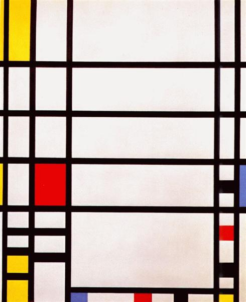
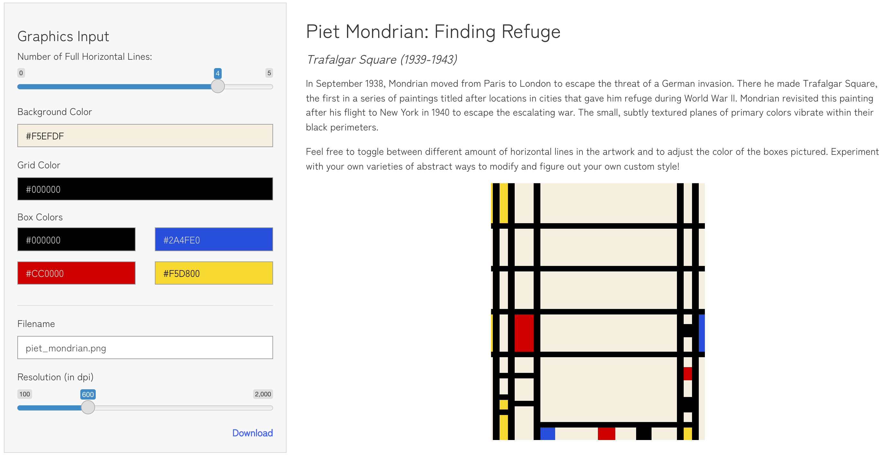

# Project 2 Write-up (Viz Biz)

*Author: Eli Feder, Lillian Clark, Phillip Harmadi, Sana Pashankar*

## Shiny App

https://phillip.shinyapps.io/viz_biz/ or tinyurl.art/313

## Introduction

We created a convenient website where non-R users and the public can navigate and customize famous modern art pieces recreated in ggplot, modifying some of the artwork aesthetics to make the masterworks their own. Our goal specifically was to promote digital extensions of modern, abstract paintings and to allow users to make personalized art downloadable for their own use. Furthermore, we also strive to increase public appreciation and awareness of using digital techniques, such as ggplot, to recreate/make original digital art. 

We present the following 4 artworks:

##### [1] Frank Stella, *Lettre sur les sourds et muets II* (1974) 

##### [2] Barbara Kruger, *Untitled (Your body is a battleground)* (1989) 

##### [3] Wassily Kandinsky, *Composition 8* (1923) 

##### [4] Piet Mondrian, *Trafalgar Square* (1939-1943) 

To recreate these modern art pieces, we fabricated our own dataframes which incorporate user input to customize certain aesthetics of each piece. We also utilized mathematical functions and specific packages such as `colourpicker` and `generativeart` to facilitate the digitization of these art pieces -- all are created in `ggplot`. 

We then accumulated these interactive art pieces in a Shiny App. Within the app,
an initial tab provides a brief overview of the project and motivation, as well as describes 
how to use it to customize and download art. The four following tabs house each of the pieces. Users
may change features such as colors, number and amount of certain shapes, transparency, and more
throughout. 

## Approaches 

### [1] Frank Stella, *Lettre sur les sourds et muets II* (1974)

The painting’s symmetrical and easily identifiable features are what
attracts us to recreate a visualization of this masterpiece. 4 distinct
features spark our interest. We also believe that these features should
be made *adjustable/modifiable* to the preference of each audience:

**Number of layers**

In the original painting, there are 12 layers
of colored-gradient rectangles and 11 layers of
black-and-white-gradient rectangles (23 layers in total),
alternating against one another. We would like the audience to be
able to determine how many layers do they want to have in total in
their final piece of art, depending on the purpose of usage 
(small/nightstand or big/wall decorations).

To alter the number of alyers, we will use the ‘slider input’ Shiny widget in the
UI interface.`sliderInput(inputId = "size", label = "Size:", min = 10, max = 50, value = 20)`
In the server, the input ‘size’ will and integral component to
create the dataframe that will be used in the plotting process.
`n <- reactive({input$size * 2})`

**Primary Gradient**

The original painting uses a rainbow-gradient color sequence as part of its 
12 layers of colored-gradient rectangles. For the recreated visualization, the
audience will be able to change this through adjusting the color
palette and decide whether or not to reverse the direction of the color sequence.
Using Shiny reactive `colourInput(...)` function, every user is able to pick any hex color
he/she wish as the starting and ending color of the gradient.

**Secondary Gradient**

The original painting uses a black-and-white-gradient color sequence as part 
of its 11 layers of non-colored-gradient rectangles. For the recreated visualization,
the audience will be able to change this through adjusting the color palette and
decide whether or not to reverse the direction of the color sequence. The same approach
of using the `colourInput(...)` function is used.

**Borderline**

We’ve noticed that the original artwork contains a thin white borderlines 
between each of the rectangle layers. We believe that some of our audience 
like this feature but not all, hence, we make it an option for the audience to 
preserve or remove the borderlines in their final plot.

To do this, we will use the ‘switch input’ Shiny widget in the UI interface to 
turn on/off the borderline.`switchInput(inputId = "borderline", label = "Borderlines", value = FALSE)`. In the server, the reactive input ‘borderline’ will be part of the aesthetic 
in the ggplot. `geom_polygon(..., size = borderline())`.

### [2] Piet Mondrian, *Trafalgar Square* (1939-1943) 

This painting’s geometric shapes and lines are what allowed us to recreate this 
visualization in ggplot2. 2 distinct features sparked our interest to make 
*adjustable/modifiable* to the preference of each audience:

**Horizontal Lines**

In the original painting, there are 4 horizontal lines that seem to be evenly 
distributed within the middle of the painting. We would like the  audience to be 
able to create more horizontal lines between the upper and lower bounds of the 
original horizontal lines to adjust the abstract feel of the art and  to make it 
more to their liking. 

Specifically to adjust these lines, we will use the ‘slider input’ Shiny widget in the UI interface
`sliderInput(inputId = "lines", label = "Number of lines:", min = 0, max = 5, value = 4)`
Because the original four horizontal lines are defined by one specific function `(geom_hline())`, 
we were able to pass the input from the UI `sliderInput` to a parameter in the `geom_hline()`
to change the number of horizontal lines between the defined upper and lower bounds. 
    
**Colors**

The original painting uses four distinct colors: blue, black 
red and yellow in different colored boxes. We wanted to give users the ability to change 
these colors based on their likings and to understand how a new color scheme 
changes the vision of the art. 

To do this, we will use the `checkboxGroupInput` in the UI interface
to allow users to select four colors out of list of multiple color options. If the user picks 
more than four colors, only the first four colors will show up. If the user uses less than 
four colors, the boxes corresponding to the missing color will show up blank (i.e. white). 

### [3] Wassily Kandinsky, *Composition 8* (1923)

We chose to recreate *Composition 8* because of Kandinsky's knack to create such larger than life
drama from largely simple geometries -- circles, polygons, and straight lines -- which are well-suited to 
`ggplot`. Only two complex shapes from the original don't appear in the recreation. Unlike his
Russian contemporaries, who pursued the abstract for its rationality, Kandinsky saw forms and colors as expressive, psychological, and even spiritual. However, his piece is also nearly a century old. Our visual world
vastly differs from that of Kandinsky's post-World War I Eastern Europe -- colors have different connotations. 
We associate them with corporate logos, Instagram filters, Tik Tok fashion trends, and more. 
We made the following aesthetics *adjustable/modifiable* to allow viewers to encode their own taste and psychology 
in the piece.

**Circle Size**

Kandinsky loved circles. He said of the circle, "It combines the concentric and the 
eccentric in a single form and in equilibrium. Of the three primary forms, it points 
most clearly to the fourth dimension." Because of these shapes' significance to the 
artist, a `sliderInput()` in the Shiny UI interface modifies the radii encoded in the 
original data which are then plotted via `geom_circle()` layers.

**Line Thickness, Shape Transparency and Background Color**

The user can also choose to modify line thickness and transparency via `sliderInput()`.
Because most of the lines in the original piece are thinner rather than thicker, this 
option has the most visual impact when the minimum thickness increases -- it makes the 
piece appear more cartoon and playful. As with previous pieces, `colourInput()` allows 
user-friendly selection of the background color. All of these user inputs modify the 
ggplot characteristics, `scale_size_manual()`, `scale_alpha_manual()`, and 
`theme(panel.background = ...)` respectively, not the data itself. 

**Shape Palette from RColorBrewer**

A dropdown list via `selectInput()` offers the user a long list of `RColorBrewer` 
palettes to choose from to color the shapes and curved lines in the piece. Instead of 
relying on custom hex codes in the data, `if` statements triggered by user selection 
in a series of plotting functions use less precise color categories from the data to 
implement these palettes. When the user implements a palette other than the original, 
this greatly improves plot rendering speed.

**Layers for Display**

Sometimes less is more. To simplify the piece, users can opt to remove any of the 
following elements as a whole: circles, quadrilaterals, triangles, straight lines, 
or curved lines. The difference is perhaps most striking when filled shapes are stripped 
away and only straight black lines remain.

**Random Noise**

A popular conception of abstract art is that it is random, thoughtlessly or mechanistically 
constructed and easy to replicate. Users can experiment for themselves with whether this 
is true by adding random values generated from a normal distribution (centered at 0 and 
with standard deviation set as "magnitude" with a `sliderInput()`) to the coordinates of 
each element. Certain elements are grouped together and experience the same transformation 
as a whole in order to retain some visual order.

### [4] Barbara Kruger, *Untitled (Your body is a battleground)* (1989)

## Discussion

Within this project, one challenge all of us faced was learning the nuances of Shiny Apps. Before this project, all of us had little to no experience with Shiny App, and the grammar of the platform and creating the app was an unfamiliar process we had to learn.

We learned a lot about the behavior of Shiny reactive inputs and how we are required to use
`reactive({...})` whenever we are trying to define a variable that is dependent on reactive
input(s). One of the biggest challenge we have tackled is to create a non-static dataset when
recreating Frank Stella's artwork. As a user modifies the number of layers in the artwork, the
dataset will adjust automatically and dynamically, hence our team created a function with the
number of layers (the reactive input) as one of the parameters of the function.

Deprecated functionality of the `order` aesthetic in `ggplot()`, an unclear ordering mechanism 
in `geom_circle()` from `ggforce`, and complex interplay between layers in the original artwork
led us to adopt a radically different approach in structuring the manually generated data for 
Kandinsky's piece. We split each dataset of a type of geometry (e.g. circles, semicircles, lines,
triangles, etc.) into layers and stored each layer as a separate dataframe in a list. (The code 
to create the original data is visib,e in `create-kandinsky-data.Rmd` in the `data` folder within
the final Shiny app.)
Because of this, we conducted all data modification and plotting through for loops and functions
which accessed specified data frames within each list. More clear and consistent methods for 
control of the order in which points are plotted withihn a layer would render this workaround 
less necessary.

Another challenge that we encountered was allowing for a user to input an image URL of his/her 
choice into our Barbara Kruger's section of the Shiny app. Not only was the link input reactive, 
but we also encountered an error where the app would crash if an invalid URL was used. To address 
this issue, we kept the original link variable if the link was valid and updated it to the Kruger's
image URL if not. We would also add an error message if the link turns out to be invalid. 

To conclude, we are satisfied with our final result. With more time, possibilities for improvement
could include allowing users to select more than 2 color checkpoints (e.g. allowing for a rainbow color, 
not just a single, continuous gradient between 2 colors) for the primary gradient and secondary gradient 
in the modified Stella, to change the thickness of the grid lines in the Mondrian, to create an animation of their custom Kandinsky devolving into random noise, to pick their own font type for the modified Kruger, and more.
